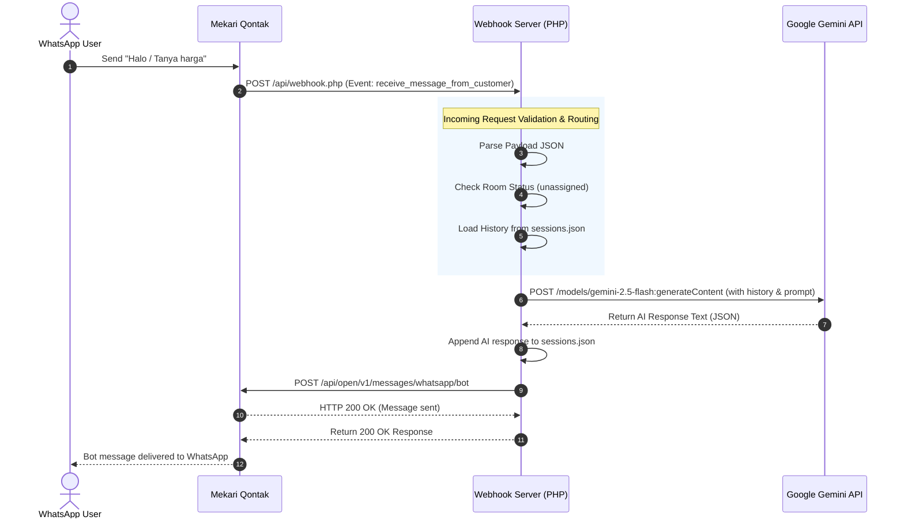

<div align="center">

<!-- Banner -->


# 🤖 Mekari Qontak WhatsApp Chatbot

### Powered by PHP & Google Gemini AI

[](https://php.net)
[](https://ai.google.dev/)
[](https://whatsapp.com)
[](https://qontak.com)
[](LICENSE)

<br/>

> A production-ready WhatsApp chatbot that combines **Mekari Qontak Open API** with **Google Gemini AI** to deliver intelligent, context-aware automated responses — built entirely in PHP.

<br/>

</div>

---

## 📋 Table of Contents

- [✨ Features](#-features)
- [🏗️ Architecture](#️-architecture)
- [🚀 Setup Instructions](#-setup-instructions)
- [⚙️ Configuration](#️-configuration)
- [📁 File Structure](#-file-structure)
- [🔍 Logging](#-logging)
- [🌐 Going Public](#-going-public)
- [🤝 Contributing](#-contributing)

---

## ✨ Features

<div align="center">

| Feature | Description |
|---|---|
| 📥 **Webhook Receiver** | Captures incoming messages via `receive_message_from_customer` event |
| 🧠 **Contextual Memory** | Maintains short-term conversation history per room using `sessions.json` |
| 🤖 **Gemini AI Integration** | Uses Gemini 2.5 Flash with a custom domain-specific system prompt |
| 📤 **Automated Replies** | Delivers AI responses directly to users via Qontak Open API |
| 📊 **Extensive Logging** | Logs inputs, routing, AI completions, latency & debug info to JSON files |

</div>

---

## 🏗️ Architecture

Below is a detailed sequence diagram highlighting the complete workflow — from the moment a user sends a WhatsApp message to when they receive an AI-generated response.



---

## 🚀 Setup Instructions

### 1. Clone the Repository

```bash
git clone https://github.com/IqbalMind/qblchatbotai.git
cd qblchatbotai
```

### 2. Configure API Keys

Open `api/webhook.php` and replace the placeholder values with your actual credentials:

```php
// Replace with your Google Gemini API Key
$geminiApiKey = 'YOUR_GEMINI_API_KEY';

// Replace with your Mekari Qontak API Token
$qontakToken  = 'YOUR_QONTAK_TOKEN';
```

> 🔑 **Get your keys:**
> - [Google Gemini API Key →](https://ai.google.dev/)
> - [Mekari Qontak API Token →](https://qontak.com)

### 3. Set Directory Permissions

Ensure the `api/` directory has write permissions so the webhook script can create and update the session and log files:

```bash
chmod 755 api/
```

The following files will be auto-created on first run:

```
api/
├── sessions.json    # Conversation history per room
├── chat_data.json   # Raw chat logs
└── data.json        # Debug & routing logs
```

### 4. Integrate with Mekari Qontak

1. Log in to your **Mekari Qontak** dashboard.
2. Navigate to **Settings → Webhook Integration**.
3. Under **"Receive new message"**, provide the public URL to your `webhook.php`:

```
https://yourdomain.com/api/webhook.php
```

> ⚠️ **Important:** Qontak requires a **publicly accessible HTTPS URL**. For local development, use a tunneling tool:

<div align="center">

| Tool | Command |
|---|---|
| **Ngrok** | `ngrok http 80` |
| **Cloudflare Tunnel** | `cloudflared tunnel --url http://localhost:80` |

</div>

---

## ⚙️ Configuration

| Variable | File | Description |
|---|---|---|
| `$geminiApiKey` | `api/webhook.php` | Your Google Gemini API key |
| `$qontakToken` | `api/webhook.php` | Your Mekari Qontak Bearer token |
| System Prompt | `api/webhook.php` | Customize the AI persona & domain |

---

## 📁 File Structure

```
qblchatbotai/
│
├── api/
│   ├── webhook.php          # 🎯 Main webhook handler & AI logic
│   ├── sessions.json        # 💬 Per-room conversation memory
│   ├── chat_data.json       # 📋 Chat log output
│   └── data.json            # 🐛 Debug & routing log
│
└── README.md
```

---

## 🔍 Logging

The system writes structured JSON logs to help with debugging and monitoring:

| File | Contents |
|---|---|
| `sessions.json` | Short-term conversation history keyed by room/group ID |
| `chat_data.json` | Full message payload, AI response, and timestamps |
| `data.json` | Routing decisions, latency metrics, and debug events |

---

## 🌐 Going Public

For production deployments, make sure you have:

- [x] A **public domain** with **HTTPS/SSL** enabled
- [x] Proper **write permissions** on the `api/` directory
- [x] Webhook URL registered in the Mekari Qontak dashboard
- [x] API keys stored securely (consider using environment variables)

---

## 🤝 Contributing

Contributions are welcome! Feel free to open an issue or submit a pull request.

1. Fork the repository
2. Create your feature branch: `git checkout -b feature/my-feature`
3. Commit your changes: `git commit -m 'Add some feature'`
4. Push to the branch: `git push origin feature/my-feature`
5. Open a Pull Request

---

<div align="center">


Made with ❤️ by [IqbalMind](https://github.com/IqbalMind)

⭐ **Star this repo if you found it helpful!**

</div>